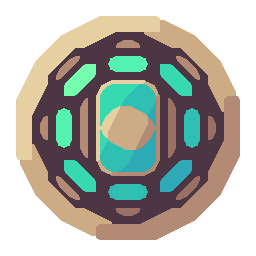

# Mau;cards

</img>

[](./LICENSE)

[](https://mau.miroq.ru/docs/)


**Mau;cards** - Небольшой сервис для сборки изображений карт для игры Mau.

**Особенности**:

- Быстрая **скорость** работы
- Поддержка нескольких **стилей**
- **Простота** использования
- **Кеширование** карт

</img>
</img>
</img>
</img>
</img>

## Использование

Ссылка на изображение карты выглядит следующим образом: https://mau.miroq.ru/card/next/0_1_1_number/cover.

Её можно представить в виде шаблона:
`https://mau.miroq.ru/card/{style}/{card}/{filter}` где.
- `{style}`: Стиль карт, `progressive` или `next`.
- `{card}`: Представление карты в Mau. `{color}_{value}_{cost}_{type}`.
- `{filter}`: Фильтр, `cover` или `uncover`.


> Более подробно смотрите в [документации](https://mau.miroq.ru/docs/use/card_generator/).

## Стили карт

Генератор поддерживает несколько стилей карт, которые определяются в директории
`assets/`.
Сейчас существует два стиля карт:

### `next`
Появился после обновления Mau v2.0. Основной стиль для карт.

</img>
</img>
</img>
</img>
</img>

Особые карты:

</img>
</img>
</img>
</img>
</img>

### `progressive`

Появились после обновления Mau v1.5.
Самый первый вариант нарисованных карт.

</img>
</img>
</img>
</img>
</img>

Особые карты:

</img>
</img>
</img>
</img>
</img>

## Установка

Если вы желаете развернуть локальный генератор карт:

- Клонируем репозиторий:

```sh
git clone https://github.com/miroqru/mau-cards
```

- Собираем сервер:

```sh
go build ./cmd/main.go
```

> Обратите внимание что директория `assets/` должна находиться рабом с
> исполняемым файлом.
